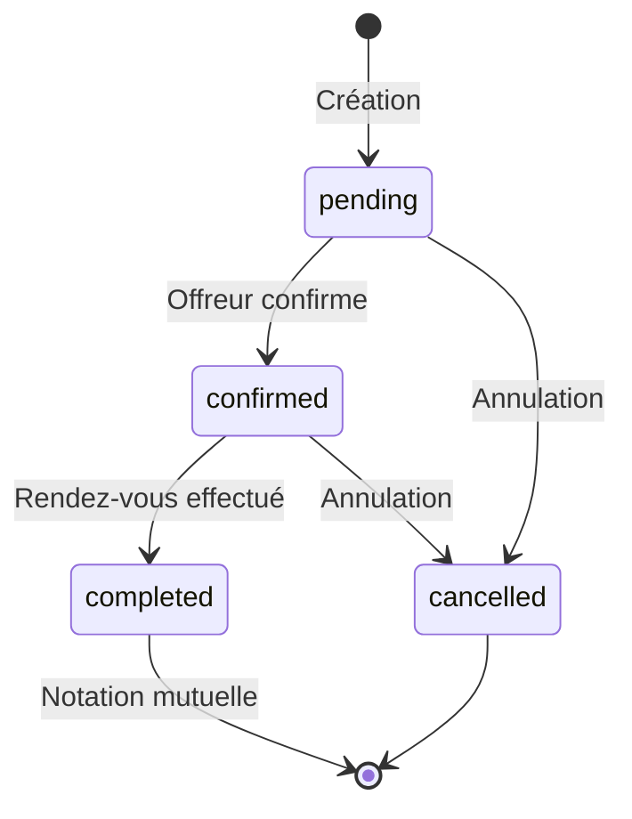

# Résumé de l'Implémentation - Fonctionnalité Offreur de Service

## 📋 Vue d'ensemble

Ce document résume l'implémentation de la fonctionnalité permettant aux **Offreurs de service** d'utiliser l'application pour gérer leurs rendez-vous et voir les loueurs à proximité.

## 🎯 Objectifs

1. ✅ Créer une page tableau de bord pour les offreurs de service
2. ✅ Implémenter la géolocalisation avec rayon de 10km
3. ✅ Permettre la prise de rendez-vous bidirectionnelle
4. ✅ Système de notation mutuelle (5 étoiles)
5. ✅ Stockage local avec AsyncStorage

## 📁 Structure des Fichiers à Créer

```
estiam-e4-mobile/
├── types/
│   └── index.ts                          # Types TypeScript
├── services/
│   ├── location.service.ts               # Géolocalisation
│   └── storage.service.ts                # AsyncStorage
├── utils/
│   └── helpers.ts                        # Fonctions utilitaires
├── context/
│   └── AppContext.tsx                    # État global
├── data/
│   └── mock-data.ts                      # Données de test
├── components/
│   ├── StarRating.tsx                    # Notation 5 étoiles
│   ├── UserCard.tsx                      # Carte utilisateur
│   └── AppointmentCard.tsx               # Carte rendez-vous
└── app/
    ├── provider-dashboard.tsx            # 🆕 Tableau de bord offreur
    ├── renters-nearby.tsx                # 🆕 Liste loueurs à proximité
    ├── user-profile.tsx                  # 🆕 Profil utilisateur
    ├── book-appointment.tsx              # 🆕 Prise de rendez-vous
    └── appointment-detail.tsx            # 🆕 Détail rendez-vous
```

## 🔄 Flux Utilisateur

### Scénario 1: Offreur de Service

```
1. Ouvre l'app → Permission localisation demandée
2. Sélectionne "Offreur de service" dans rent.tsx
3. Arrive sur provider-dashboard.tsx
   ├── Voit ses statistiques (note moyenne, nb rendez-vous)
   ├── Voit les rendez-vous en attente
   └── Voit les prochains rendez-vous
4. Clique "Voir les loueurs à proximité"
5. Voit la liste des loueurs dans un rayon de 10km
6. Sélectionne un loueur → Voit son profil
7. Peut confirmer/annuler des rendez-vous
8. Après rendez-vous → Note le loueur (1-5 étoiles)
```

### Scénario 2: Loueur de Service

```
1. Sélectionne "Loueur de service" dans rent.tsx
2. Arrive sur offers.tsx (existant)
3. Voit la liste des offreurs dans un rayon de 10km
4. Sélectionne un offreur → Voit son profil
5. Clique "Prendre rendez-vous"
6. Sélectionne date/heure → Confirme
7. Rendez-vous créé (status: pending)
8. Après rendez-vous → Note l'offreur (1-5 étoiles)
```

## 🛠️ Technologies Utilisées

| Technologie | Usage |
|-------------|-------|
| **expo-location** | Géolocalisation GPS |
| **@react-native-async-storage/async-storage** | Stockage local |
| **React Context API** | Gestion d'état global |
| **TypeScript** | Typage fort |
| **Expo Router** | Navigation |

## 📊 Modèle de Données

### User (Utilisateur)
```typescript
{
  id: string
  firstName: string
  lastName: string
  userType: 'renter' | 'provider'
  location: {
    latitude: number
    longitude: number
    city: string
  }
  rating: number
  totalAppointments: number
}
```

### Appointment (Rendez-vous)
```typescript
{
  id: string
  renterId: string
  providerId: string
  date: string
  time: string
  status: 'pending' | 'confirmed' | 'completed' | 'cancelled'
  renterRating?: Rating
  providerRating?: Rating
}
```

### Rating (Notation)
```typescript
{
  score: number  // 1-5
  comment?: string
  createdAt: string
  createdBy: string
}
```

## 🎨 Composants Clés

### 1. StarRating
Composant de notation réutilisable
- Affichage en lecture seule ou éditable
- 5 étoiles par défaut
- Callback pour changement de note

### 2. UserCard
Carte d'affichage utilisateur
- Photo de profil
- Nom complet
- Ville
- Note moyenne
- Distance (si applicable)
- Nombre de rendez-vous

### 3. AppointmentCard
Carte de rendez-vous
- Informations de l'autre utilisateur
- Date et heure
- Statut (badge coloré)
- Actions contextuelles

## 🔐 Permissions Requises

### iOS
```xml
NSLocationWhenInUseUsageDescription
NSLocationAlwaysUsageDescription
```

### Android
```xml
ACCESS_COARSE_LOCATION
ACCESS_FINE_LOCATION
```

## 📐 Calcul de Distance

Utilisation de la **formule de Haversine** pour calculer la distance entre deux points GPS:

```typescript
function calculateDistance(lat1, lon1, lat2, lon2) {
  const R = 6371; // Rayon de la Terre en km
  const dLat = toRad(lat2 - lat1);
  const dLon = toRad(lon2 - lon1);
  
  const a = Math.sin(dLat/2) * Math.sin(dLat/2) +
            Math.cos(toRad(lat1)) * Math.cos(toRad(lat2)) *
            Math.sin(dLon/2) * Math.sin(dLon/2);
  
  const c = 2 * Math.atan2(Math.sqrt(a), Math.sqrt(1-a));
  return R * c;
}
```

## 🎯 Fonctionnalités Principales

### Pour les Offreurs
- ✅ Tableau de bord avec statistiques
- ✅ Liste des rendez-vous (en attente, confirmés, à venir)
- ✅ Voir les loueurs à proximité (10km)
- ✅ Confirmer/annuler des rendez-vous
- ✅ Noter les loueurs après rendez-vous

### Pour les Loueurs
- ✅ Liste des offreurs à proximité (10km)
- ✅ Voir profils détaillés
- ✅ Prendre rendez-vous
- ✅ Noter les offreurs après rendez-vous

### Fonctionnalités Communes
- ✅ Géolocalisation automatique
- ✅ Calcul de distance en temps réel
- ✅ Système de notation bidirectionnel
- ✅ Historique des rendez-vous
- ✅ Profils utilisateurs détaillés

## 📱 Pages à Créer

### 1. provider-dashboard.tsx
**Tableau de bord pour offreurs**
- En-tête avec statistiques personnelles
- Section "Rendez-vous en attente"
- Section "Prochains rendez-vous"
- Bouton "Voir les loueurs à proximité"

### 2. renters-nearby.tsx
**Liste des loueurs à proximité**
- Filtrage automatique (10km)
- Tri par distance
- Affichage des notes
- Navigation vers profil

### 3. user-profile.tsx
**Profil utilisateur détaillé**
- Informations complètes
- Note moyenne et nombre de rendez-vous
- Historique (si applicable)
- Bouton d'action (prendre RDV ou retour)

### 4. book-appointment.tsx
**Formulaire de prise de rendez-vous**
- Sélecteur de date
- Sélecteur d'heure
- Notes optionnelles
- Bouton de confirmation

### 5. appointment-detail.tsx
**Détail d'un rendez-vous**
- Informations complètes
- Actions selon statut
- Système de notation (si complété)

## 🔄 États des Rendez-vous



## 🚀 Ordre d'Implémentation

### Phase 1: Fondations (2-3h)
1. Installer dépendances
2. Créer types TypeScript
3. Créer structure de dossiers

### Phase 2: Services (3-4h)
4. LocationService
5. StorageService
6. Helpers utilitaires
7. Données de test

### Phase 3: État Global (2h)
8. AppContext
9. Intégration dans _layout.tsx
10. Gestion permissions

### Phase 4: Composants UI (3h)
11. StarRating
12. UserCard
13. AppointmentCard

### Phase 5: Pages Principales (4-5h)
14. provider-dashboard.tsx
15. renters-nearby.tsx
16. Mise à jour rent.tsx

### Phase 6: Pages Secondaires (4-5h)
17. user-profile.tsx
18. book-appointment.tsx
19. appointment-detail.tsx

### Phase 7: Finalisation (2-3h)
20. Système de notation
21. Tests complets
22. Ajustements UI/UX

**Temps total estimé: 20-25 heures de développement**

## 📝 Checklist de Validation

### Fonctionnalités
- [ ] Géolocalisation fonctionne
- [ ] Calcul de distance correct
- [ ] Filtrage par rayon (10km)
- [ ] Création de rendez-vous
- [ ] Confirmation de rendez-vous
- [ ] Annulation de rendez-vous
- [ ] Notation 5 étoiles
- [ ] Calcul note moyenne
- [ ] Stockage persistant

### UX/UI
- [ ] Navigation fluide
- [ ] Feedback visuel
- [ ] Messages d'erreur clairs
- [ ] États de chargement
- [ ] Design cohérent
- [ ] Responsive

### Technique
- [ ] Pas d'erreurs console
- [ ] Types TypeScript corrects
- [ ] Gestion des erreurs
- [ ] Performance optimale
- [ ] Code commenté

## 🎨 Design System

### Couleurs
```typescript
const colors = {
  primary: '#2563EB',      // Bleu pour actions principales
  success: '#10B981',      // Vert pour confirmations
  warning: '#F59E0B',      // Orange pour en attente
  danger: '#EF4444',       // Rouge pour annulations
  gray: {
    50: '#F9FAFB',
    100: '#F3F4F6',
    200: '#E5E7EB',
    300: '#D1D5DB',
    600: '#4B5563',
    900: '#111827',
  }
}
```

### Espacements
```typescript
const spacing = {
  xs: 4,
  sm: 8,
  md: 16,
  lg: 24,
  xl: 32,
}
```

### Typographie
```typescript
const typography = {
  title: { fontSize: 24, fontWeight: '700' },
  subtitle: { fontSize: 18, fontWeight: '600' },
  body: { fontSize: 16, fontWeight: '400' },
  caption: { fontSize: 14, fontWeight: '400' },
}
```

## 🔍 Points d'Attention

### Performance
- Utiliser `useMemo` pour calculs de distance
- Implémenter virtualisation pour longues listes
- Optimiser re-renders

### Sécurité
- Valider toutes les entrées
- Gérer les permissions refusées
- Protéger données sensibles

### Accessibilité
- Labels pour lecteurs d'écran
- Contraste suffisant
- Tailles de touche minimales (44x44pt)

## 📚 Ressources

- [Expo Location Documentation](https://docs.expo.dev/versions/latest/sdk/location/)
- [AsyncStorage Documentation](https://react-native-async-storage.github.io/async-storage/)
- [Expo Router Documentation](https://docs.expo.dev/router/introduction/)
- [React Context API](https://react.dev/reference/react/useContext)

## 🎉 Résultat Attendu

Une application mobile complète permettant:
- Aux **offreurs** de gérer leurs rendez-vous et voir les loueurs à proximité
- Aux **loueurs** de trouver des offreurs à proximité et prendre rendez-vous
- Un système de **notation mutuelle** pour établir la confiance
- Une **géolocalisation précise** avec filtrage par distance
- Une **expérience utilisateur fluide** et intuitive

---

**Document créé le**: 13 janvier 2026  
**Version**: 1.0  
**Auteur**: Kilo Code (Architect Mode)