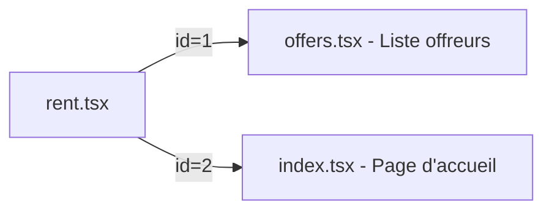
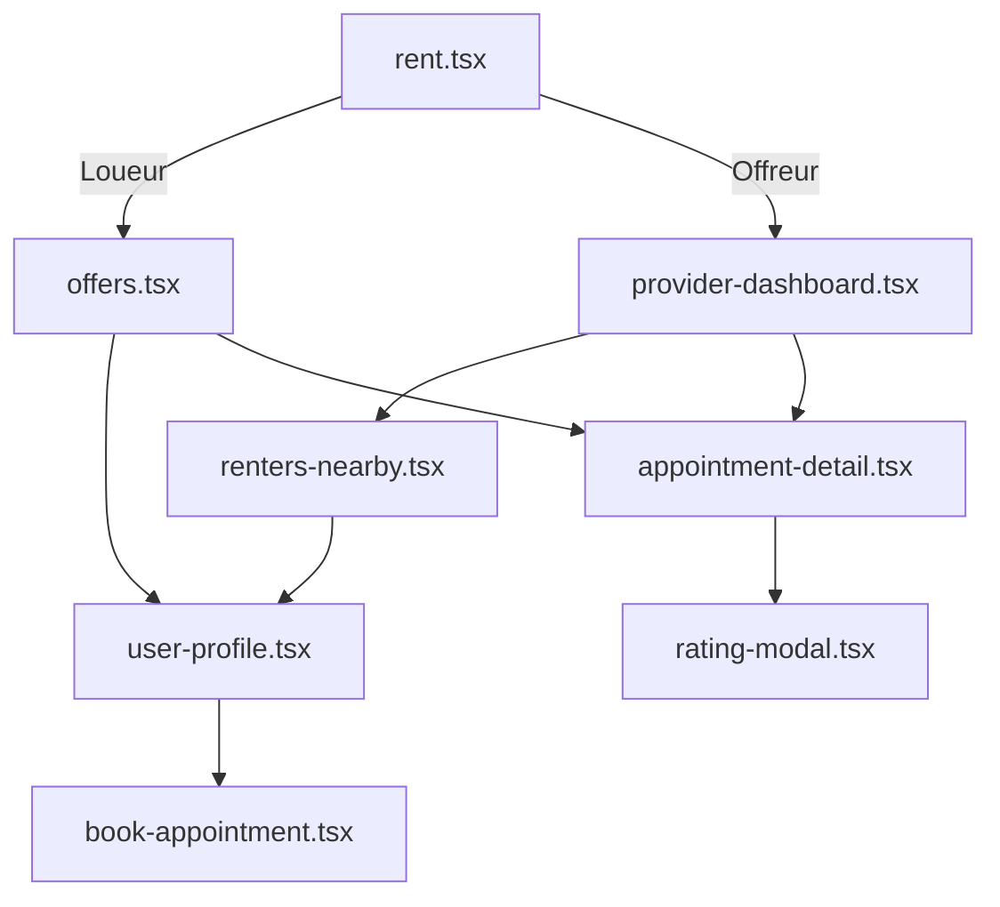
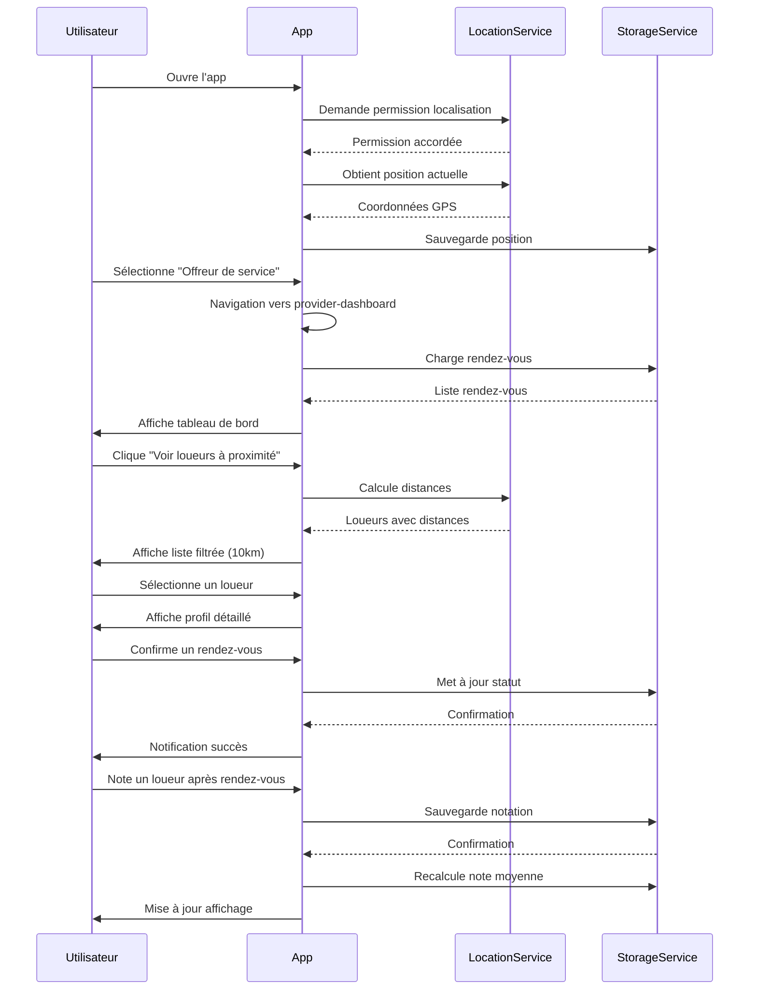
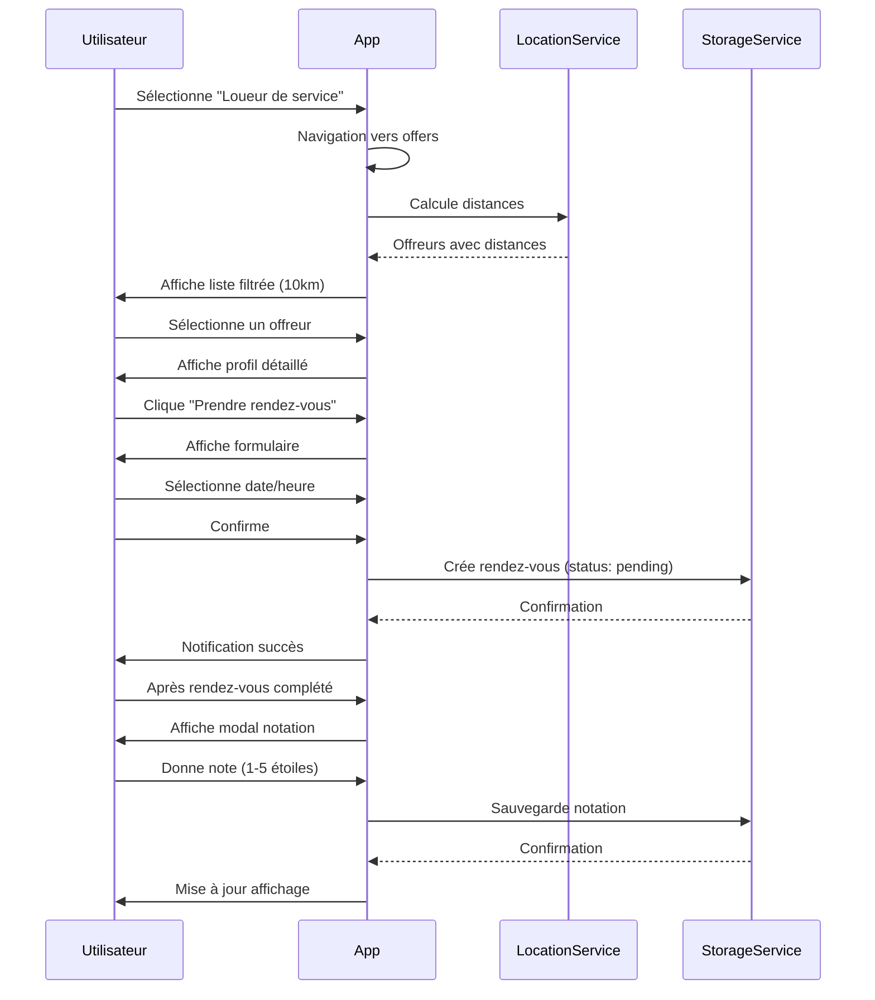

# Plan d'Architecture - Fonctionnalité Offreur de Service

## Vue d'ensemble

Ce document décrit l'architecture complète pour implémenter la fonctionnalité permettant aux "Offreurs de service" et "Loueurs de service" d'interagir via une application mobile React Native/Expo.

## Contexte Actuel

### Structure Existante
- **Framework**: React Native avec Expo Router
- **Navigation**: Tabs avec 5 onglets (index, explore, rent, chat, camera)
- **Page actuelle**: [`rent.tsx`](app/(tabs)/rent.tsx:1) permet de choisir entre "Loueur" (id=1) et "Offreur" (id=2)
- **Page loueur**: [`offers.tsx`](app/offers.tsx:1) affiche la liste des offreurs à proximité

### Flux Utilisateur Actuel


## Architecture Proposée

### 1. Structure des Données

#### Types TypeScript (`types/index.ts`)

```typescript
// Type d'utilisateur
export type UserType = 'renter' | 'provider';

// Statut de rendez-vous
export type AppointmentStatus = 'pending' | 'confirmed' | 'completed' | 'cancelled';

// Interface Utilisateur
export interface User {
  id: string;
  firstName: string;
  lastName: string;
  email: string;
  phone?: string;
  userType: UserType;
  location: Location;
  rating: number;
  totalAppointments: number;
  createdAt: string;
  profileImage?: string;
}

// Interface Localisation
export interface Location {
  latitude: number;
  longitude: number;
  city: string;
  address?: string;
  lastUpdated: string;
}

// Interface Rendez-vous
export interface Appointment {
  id: string;
  renterId: string;
  providerId: string;
  date: string;
  time: string;
  status: AppointmentStatus;
  service?: string;
  notes?: string;
  createdAt: string;
  renterRating?: Rating;
  providerRating?: Rating;
}

// Interface Notation
export interface Rating {
  score: number; // 1-5
  comment?: string;
  createdAt: string;
  createdBy: string;
}

// Interface pour utilisateur avec distance
export interface UserWithDistance extends User {
  distance: number; // en km
}
```

### 2. Services et Utilitaires

#### Service de Géolocalisation (`services/location.service.ts`)

```typescript
import * as Location from 'expo-location';

export class LocationService {
  // Demander les permissions
  static async requestPermissions(): Promise<boolean>
  
  // Obtenir la position actuelle
  static async getCurrentLocation(): Promise<Location.LocationObject>
  
  // Surveiller la position (pour mise à jour en temps réel)
  static async watchLocation(callback: (location: Location.LocationObject) => void)
  
  // Calculer la distance entre deux points (formule Haversine)
  static calculateDistance(
    lat1: number, 
    lon1: number, 
    lat2: number, 
    lon2: number
  ): number
  
  // Filtrer les utilisateurs dans un rayon donné
  static filterByRadius(
    users: User[], 
    currentLocation: Location, 
    radiusKm: number = 10
  ): UserWithDistance[]
}
```

#### Service de Stockage (`services/storage.service.ts`)

```typescript
import AsyncStorage from '@react-native-async-storage/async-storage';

export class StorageService {
  // Clés de stockage
  private static KEYS = {
    CURRENT_USER: '@current_user',
    USERS: '@users',
    APPOINTMENTS: '@appointments',
    RATINGS: '@ratings',
  };
  
  // Utilisateur courant
  static async saveCurrentUser(user: User): Promise<void>
  static async getCurrentUser(): Promise<User | null>
  static async clearCurrentUser(): Promise<void>
  
  // Gestion des utilisateurs
  static async saveUsers(users: User[]): Promise<void>
  static async getUsers(): Promise<User[]>
  static async addUser(user: User): Promise<void>
  static async updateUser(userId: string, updates: Partial<User>): Promise<void>
  
  // Gestion des rendez-vous
  static async saveAppointments(appointments: Appointment[]): Promise<void>
  static async getAppointments(): Promise<Appointment[]>
  static async addAppointment(appointment: Appointment): Promise<void>
  static async updateAppointment(id: string, updates: Partial<Appointment>): Promise<void>
  
  // Gestion des notations
  static async addRating(appointmentId: string, rating: Rating, isProvider: boolean): Promise<void>
}
```

#### Utilitaires (`utils/helpers.ts`)

```typescript
// Formater la distance
export function formatDistance(km: number): string {
  if (km < 1) return `${Math.round(km * 1000)}m`;
  return `${km.toFixed(1)}km`;
}

// Formater la date
export function formatDate(dateString: string): string {
  // Format: "13 janvier 2026"
}

// Formater l'heure
export function formatTime(timeString: string): string {
  // Format: "14:30"
}

// Générer un ID unique
export function generateId(): string {
  return `${Date.now()}-${Math.random().toString(36).substr(2, 9)}`;
}

// Calculer la note moyenne
export function calculateAverageRating(ratings: Rating[]): number {
  if (ratings.length === 0) return 0;
  const sum = ratings.reduce((acc, r) => acc + r.score, 0);
  return sum / ratings.length;
}
```

### 3. Contexte Global (`context/AppContext.tsx`)

```typescript
import React, { createContext, useContext, useState, useEffect } from 'react';

interface AppContextType {
  currentUser: User | null;
  setCurrentUser: (user: User | null) => void;
  users: User[];
  appointments: Appointment[];
  updateUserLocation: (location: Location) => Promise<void>;
  createAppointment: (appointment: Omit<Appointment, 'id' | 'createdAt'>) => Promise<void>;
  updateAppointmentStatus: (id: string, status: AppointmentStatus) => Promise<void>;
  addRating: (appointmentId: string, rating: Rating, isProvider: boolean) => Promise<void>;
  getUsersNearby: (radiusKm?: number) => UserWithDistance[];
  getMyAppointments: () => Appointment[];
  getPendingAppointments: () => Appointment[];
}

export const AppContext = createContext<AppContextType | undefined>(undefined);

export function AppProvider({ children }: { children: React.ReactNode }) {
  // État global
  // Méthodes de gestion
  // Chargement initial depuis AsyncStorage
  // Synchronisation avec AsyncStorage
}

export function useApp() {
  const context = useContext(AppContext);
  if (!context) throw new Error('useApp must be used within AppProvider');
  return context;
}
```

### 4. Composants UI

#### Composant de Notation (`components/StarRating.tsx`)

```typescript
interface StarRatingProps {
  rating: number;
  maxStars?: number;
  size?: number;
  editable?: boolean;
  onRatingChange?: (rating: number) => void;
}

export function StarRating({ 
  rating, 
  maxStars = 5, 
  size = 24, 
  editable = false,
  onRatingChange 
}: StarRatingProps) {
  // Affichage des étoiles
  // Gestion du clic si editable
}
```

#### Carte de Rendez-vous (`components/AppointmentCard.tsx`)

```typescript
interface AppointmentCardProps {
  appointment: Appointment;
  user: User; // L'autre utilisateur (provider ou renter)
  onPress?: () => void;
  showActions?: boolean;
}

export function AppointmentCard({ 
  appointment, 
  user, 
  onPress,
  showActions = false 
}: AppointmentCardProps) {
  // Affichage des infos du rendez-vous
  // Boutons d'action (confirmer, annuler, noter)
}
```

#### Carte Utilisateur (`components/UserCard.tsx`)

```typescript
interface UserCardProps {
  user: UserWithDistance;
  onPress?: () => void;
  showDistance?: boolean;
}

export function UserCard({ 
  user, 
  onPress,
  showDistance = true 
}: UserCardProps) {
  // Affichage des infos utilisateur
  // Distance si disponible
  // Note moyenne
}
```

### 5. Pages/Écrans

#### Page Tableau de Bord Offreur (`app/provider-dashboard.tsx`)

**Fonctionnalités:**
- Statistiques personnelles (note moyenne, nombre de rendez-vous)
- Liste des rendez-vous à venir
- Demandes de rendez-vous en attente
- Accès au profil

**Structure:**
```typescript
export default function ProviderDashboard() {
  const { currentUser, getMyAppointments, getPendingAppointments } = useApp();
  
  // Sections:
  // 1. En-tête avec stats
  // 2. Rendez-vous en attente (à confirmer)
  // 3. Prochains rendez-vous
  // 4. Bouton "Voir les loueurs à proximité"
}
```

#### Page Liste des Loueurs (`app/renters-nearby.tsx`)

**Fonctionnalités:**
- Liste des loueurs dans un rayon de 10km
- Tri par distance
- Affichage de la note et du nombre de rendez-vous
- Accès au profil détaillé

```typescript
export default function RentersNearby() {
  const { getUsersNearby, currentUser } = useApp();
  
  // Filtrer les loueurs uniquement
  // Afficher avec distance
  // Navigation vers profil
}
```

#### Page Profil Utilisateur (`app/user-profile.tsx`)

**Fonctionnalités:**
- Informations détaillées
- Historique des rendez-vous
- Notes reçues
- Bouton "Prendre rendez-vous" (si applicable)

```typescript
export default function UserProfile() {
  const { userId } = useLocalSearchParams();
  
  // Afficher les détails
  // Historique
  // Bouton d'action
}
```

#### Page Prise de Rendez-vous (`app/book-appointment.tsx`)

**Fonctionnalités:**
- Sélection de date (calendrier)
- Sélection d'heure
- Notes optionnelles
- Confirmation

```typescript
export default function BookAppointment() {
  const { userId } = useLocalSearchParams();
  
  // Formulaire de rendez-vous
  // Validation
  // Création
}
```

#### Page Détail Rendez-vous (`app/appointment-detail.tsx`)

**Fonctionnalités:**
- Informations complètes
- Actions selon statut (confirmer, annuler, noter)
- Affichage des notes si complété

```typescript
export default function AppointmentDetail() {
  const { appointmentId } = useLocalSearchParams();
  
  // Détails du rendez-vous
  // Actions contextuelles
  // Système de notation
}
```

### 6. Navigation et Routing

#### Mise à jour de [`rent.tsx`](app/(tabs)/rent.tsx:44)

```typescript
// Ligne 44 - Modifier la navigation pour item.id = 2
onPress={() => 
  item.id === "1" 
    ? router.push("/offers") 
    : router.push("/provider-dashboard")
}
```

#### Structure de Navigation Complète



### 7. Gestion des Permissions

#### Au démarrage de l'app (`app/_layout.tsx`)

```typescript
useEffect(() => {
  async function initializeApp() {
    // 1. Demander permission de localisation
    const { status } = await Location.requestForegroundPermissionsAsync();
    
    if (status === 'granted') {
      // 2. Obtenir la position actuelle
      const location = await LocationService.getCurrentLocation();
      
      // 3. Mettre à jour la position de l'utilisateur
      await updateUserLocation(location);
    }
  }
  
  initializeApp();
}, []);
```

### 8. Données de Test

#### Fichier de données initiales (`data/mock-data.ts`)

```typescript
export const MOCK_USERS: User[] = [
  {
    id: '1',
    firstName: 'Marie',
    lastName: 'Dupont',
    email: 'marie.dupont@example.com',
    userType: 'provider',
    location: {
      latitude: 48.8566,
      longitude: 2.3522,
      city: 'Paris',
      lastUpdated: new Date().toISOString(),
    },
    rating: 4.5,
    totalAppointments: 27,
    createdAt: '2025-01-01T00:00:00Z',
  },
  // ... autres utilisateurs
];

export const MOCK_APPOINTMENTS: Appointment[] = [
  // ... rendez-vous de test
];
```

### 9. Flux Utilisateur Complet

#### Pour un Offreur de Service



#### Pour un Loueur de Service



### 10. Dépendances à Installer

```bash
npx expo install expo-location
npx expo install @react-native-async-storage/async-storage
```

### 11. Configuration Requise

#### `app.json` - Permissions

```json
{
  "expo": {
    "plugins": [
      [
        "expo-location",
        {
          "locationAlwaysAndWhenInUsePermission": "Allow $(PRODUCT_NAME) to use your location to find nearby service providers."
        }
      ]
    ],
    "ios": {
      "infoPlist": {
        "NSLocationWhenInUseUsageDescription": "This app needs access to your location to find nearby service providers.",
        "NSLocationAlwaysUsageDescription": "This app needs access to your location to find nearby service providers."
      }
    },
    "android": {
      "permissions": [
        "ACCESS_COARSE_LOCATION",
        "ACCESS_FINE_LOCATION"
      ]
    }
  }
}
```

## Ordre d'Implémentation Recommandé

1. **Phase 1: Fondations**
   - Installer dépendances
   - Créer types TypeScript
   - Créer structure de dossiers (services, utils, context, data)

2. **Phase 2: Services Core**
   - Implémenter LocationService
   - Implémenter StorageService
   - Créer utilitaires helpers
   - Créer données de test

3. **Phase 3: État Global**
   - Implémenter AppContext
   - Intégrer dans [`_layout.tsx`](app/_layout.tsx:1)
   - Gérer permissions au démarrage

4. **Phase 4: Composants UI**
   - Créer StarRating
   - Créer UserCard
   - Créer AppointmentCard

5. **Phase 5: Pages Principales**
   - Créer provider-dashboard.tsx
   - Créer renters-nearby.tsx
   - Mettre à jour navigation dans [`rent.tsx`](app/(tabs)/rent.tsx:44)

6. **Phase 6: Pages Secondaires**
   - Créer user-profile.tsx
   - Créer book-appointment.tsx
   - Créer appointment-detail.tsx

7. **Phase 7: Fonctionnalités Avancées**
   - Implémenter système de notation
   - Ajouter gestion des statuts de rendez-vous
   - Optimiser calculs de distance

8. **Phase 8: Tests et Refinement**
   - Tester flux complet
   - Ajuster UI/UX
   - Gérer cas d'erreur

## Considérations Techniques

### Performance
- Utiliser `useMemo` pour calculs de distance
- Implémenter pagination pour grandes listes
- Optimiser re-renders avec `React.memo`

### Sécurité
- Valider toutes les entrées utilisateur
- Gérer les erreurs de permission
- Protéger les données sensibles

### UX
- Feedback visuel pour toutes les actions
- Messages d'erreur clairs
- États de chargement appropriés
- Animations fluides

### Accessibilité
- Labels appropriés pour lecteurs d'écran
- Contraste de couleurs suffisant
- Tailles de touche minimales (44x44pt)

## Évolutions Futures

1. **Backend API**
   - Remplacer AsyncStorage par API REST
   - Authentification JWT
   - Notifications push

2. **Fonctionnalités Avancées**
   - Chat en temps réel
   - Paiements intégrés
   - Historique détaillé
   - Filtres avancés (prix, disponibilité, spécialités)

3. **Optimisations**
   - Cache des données
   - Synchronisation offline
   - Géolocalisation en arrière-plan

## Conclusion

Ce plan fournit une architecture complète et modulaire pour implémenter la fonctionnalité "Offreur de service". L'approche progressive permet de construire les fondations solides avant d'ajouter les fonctionnalités complexes.

La séparation claire entre services, contexte, et composants UI facilite la maintenance et l'évolution future du code.